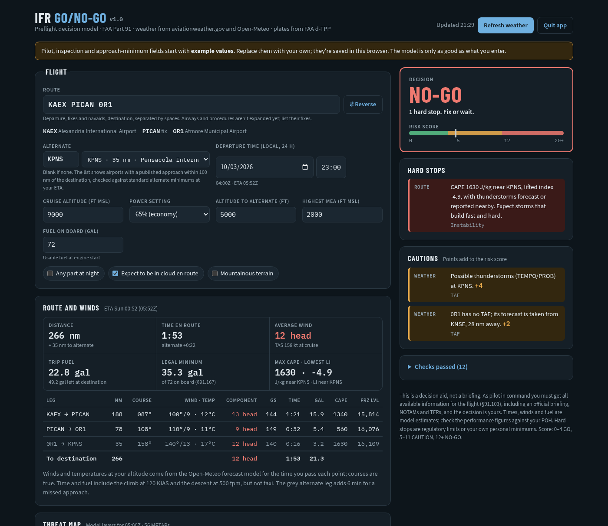

# IFR Go/No-Go

A preflight go/no-go decision aid for instrument pilots flying under FAA Part 91.

Enter your route, departure time, airplane and personal minimums. IFR Go/No-Go pulls the current weather and forecasts, checks the flight against the regulations and your own limits, and gives a **GO / CAUTION / NO-GO** verdict with the reason for every point.



> **This is a decision aid, not a briefing.** As pilot in command you must get all available information for the flight (§91.103), including an official briefing, NOTAMs and TFRs. Forecasts and models can be wrong, and the result is only as good as what you enter. The decision is always yours.

## What it checks

- **Departure, destination and alternate weather.** METARs and TAFs at your times, checked against the approach minimums you fly plus your personal margins, crosswind and gust limits.
- **Alternate requirement and alternate minimums (§91.169).** It shows whether you need an alternate, and lists every airport with a published approach within 100 nm of the destination, nearest first, with its distance and whether its TAF meets alternate minimums at your arrival time.
- **Fuel (§91.167).** Trip, alternate and 45-minute reserve, from a climb/cruise/descent simulation with forecast winds aloft, plus your own landing reserve.
- **Along the route.** SIGMETs, convective SIGMETs, G-AIRMETs, PIREPs, freezing level vs. MEA and cruise, model cloud bases and tops.
- **Instability.** Model CAPE and lifted index along the route at the time you pass each point; the worse of the two decides.
- **Pilot and airplane.** IFR currency, recent IMC and time in type, sleep, and inspections (annual, pitot-static, transponder, ELT, VOR check).

It also shows:

- **A threat map** with SIGMETs, G-AIRMETs, PIREPs, METAR flight categories, model CAPE and cloud bases and tops.
- **A vertical profile** of model clouds, freezing level, CAPE and lifted index along your flight path. You can zoom and pan it.
- **Leg-by-leg winds, groundspeed, time and fuel.**
- **Links to the current approach plates** from the FAA d-TPP.
- **A Reverse button** that flies the route the other way, swaps the approaches and picks a new alternate.

Your settings and personal minimums are saved in your browser. Nothing about you or your flight is uploaded anywhere; the app only downloads weather, charts, map tiles and fonts.

## Running it

You need **Python 3.8 or newer**. The app uses only Python's standard library, so there is nothing else to install.

1. Download the latest release (**Code → Download ZIP**) and unzip it, or `git clone` this repository.
2. Start it:
   - **Windows:** double-click `start-windows.bat`. If Python isn't installed, get it from [python.org](https://www.python.org/downloads/) and tick "Add python.exe to PATH" during setup.
   - **Mac:** double-click `start-mac.command`. The first time, macOS may block it: right-click it, choose **Open**, then **Open** again.
   - **Linux:** run `./start-linux.sh`, or `python3 server.py`.
3. Your browser opens at <http://127.0.0.1:8737>. Leave the window that started it open while you use the app. The **Quit app** button stops it.

The first start downloads airport, runway and navaid data from OurAirports (about 35 MB) and the FAA approach-chart index. They are cached in `~/.cache/ifr-go-no-go/` and refreshed automatically: every week for airports, every 28-day cycle for charts.

Options:

```
python3 server.py --no-browser     # don't open a browser tab
PORT=9000 python3 server.py        # use another port
```

The server listens only on your own computer (127.0.0.1). It isn't meant to be put on the internet as is.

## Getting started

1. Fields marked **Example values** come pre-filled. Replace them with your own airplane, approaches, inspection dates and personal minimums.
2. The airplane preset is a Mooney M20K 231. Choose **Custom** and enter your POH climb, cruise and fuel figures for anything else.
3. Enter the route as departure, fixes or navaids, and destination, separated by spaces, e.g. `KAEX PICAN 0R1`. Airways and SIDs/STARs aren't expanded yet, so list their fixes.

## Limits

- **US only.** It uses FAA rules, aviationweather.gov and the FAA d-TPP.
- **Alternate minimums.** The alternate list uses standard alternate minimums (600-2 with an ILS, 800-2 otherwise). It can't see non-standard alternate minimums (the ▲A note on the plate); enter those in the alternate section.
- **Model data.** Cloud, CAPE, lifted index, freezing level and winds aloft come from the Open-Meteo forecast model. They are estimates, not observations.
- **Not checked.** NOTAMs, TFRs, terrain, airspace and runway closures. Get an official briefing.

## Data sources

| Source | Used for | Terms |
|---|---|---|
| [aviationweather.gov](https://aviationweather.gov/data/api/) (NOAA/NWS) | METAR, TAF, PIREP, SIGMET, G-AIRMET, fixes | US government, public domain |
| [Open-Meteo](https://open-meteo.com/) | Winds aloft, temperature, cloud cover, CAPE, lifted index, freezing level | [CC BY 4.0](https://open-meteo.com/en/license), free for non-commercial use |
| [OurAirports](https://ourairports.com/data/) | Airports, runways, navaids | Public domain |
| [FAA d-TPP](https://www.faa.gov/air_traffic/flight_info/aeronav/digital_products/dtpp/) | Instrument approach charts | US government, public domain |
| [OpenStreetMap](https://www.openstreetmap.org/copyright) | Map tiles | © OpenStreetMap contributors, ODbL |

## License

[MIT](LICENSE). Provided as is, without warranty of any kind. See the disclaimer above.
